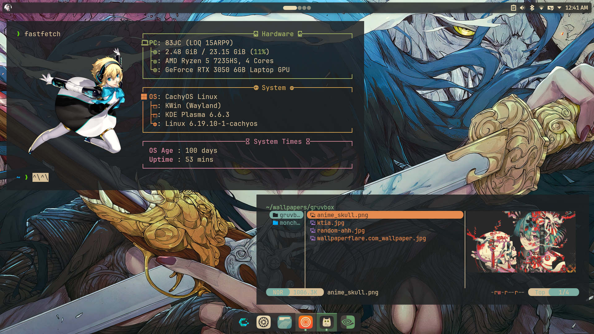
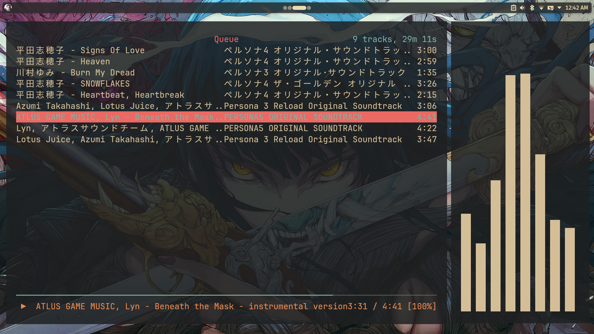
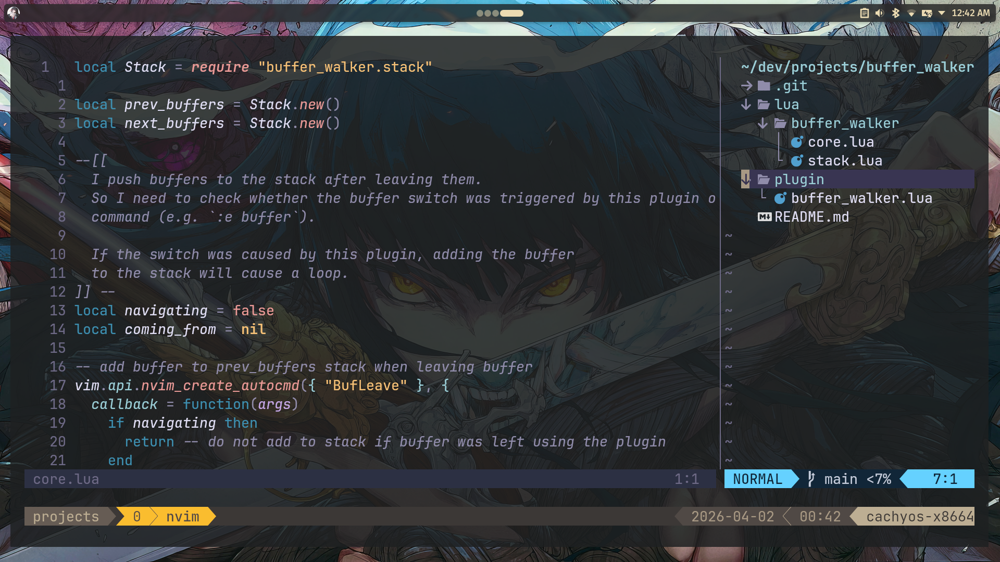

# My Dotfiles

This repository contains the dotfiles I use to setup my Terminal workflow on my Linux system

  
  
  

## Dotfiles Included

- **Neovim**: Code\Text Editor.
- **Tmux**: Session and Window manager in Terminal.
- **Kitty**: Primary Terminal Emulator.
- **Alacritty**: Terminal emulator.
- **Cava**: Audio visualizer.
- **Fastfetch**: System information display setup.
- **Yazi**: Terminal file manager
- **ZSH**: Shell

## ⚠️ Link.sh script
The link.sh script creates symbolic links from the dotfiles directory to their respective configuration locations.
Warning: It will delete any existing configuration directories for the listed tools before creating the symlinks. Use with caution.
