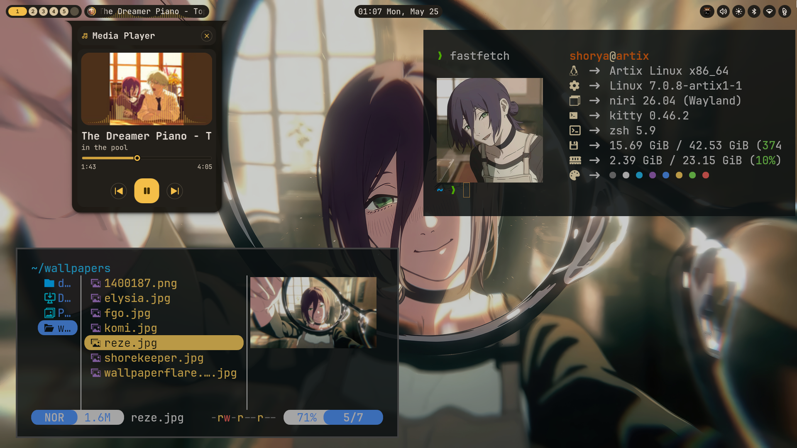
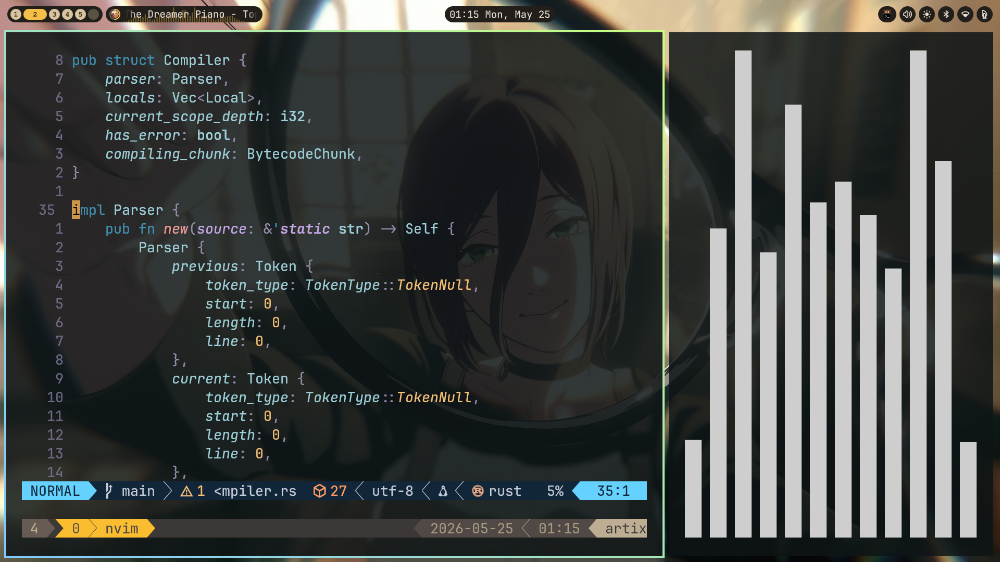
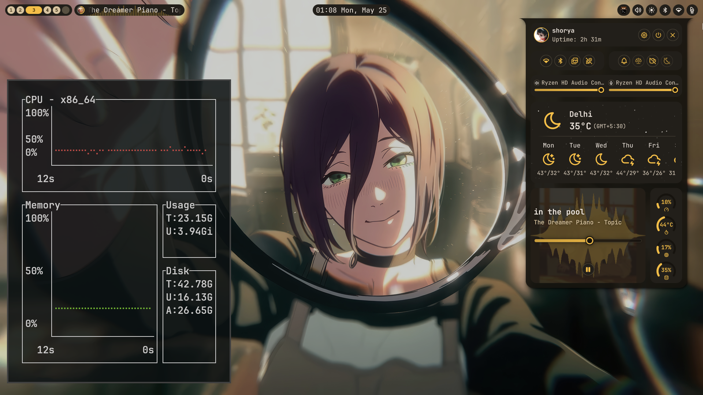

# My Dotfiles

This repository contains the dotfiles for setting up Niri and my terminal workflow.

Check branches to find configs for 
- **Qtile**
- **KDE**

  
  
  

## Dotfiles Included

- **Niri**: Scrollable Tiling Window Manager.
- **Noctalia Shell**: Desktop Shell.
- **Tofi**: Laucher.
- **Fastfetch**: System information display setup.
- **Neovim**: Code\Text Editor.
- **Tmux**: Session and Window manager in Terminal.
- **Kitty**: Primary Terminal Emulator.
- **Cava**: Audio visualizer.
- **ZSH**: Shell

## ⚠️ Link.sh script
The link.sh script creates symbolic links from the dotfiles directory to their respective configuration locations.
Warning: It will delete any existing configuration directories for the listed tools before creating the symlinks. Use with caution.
